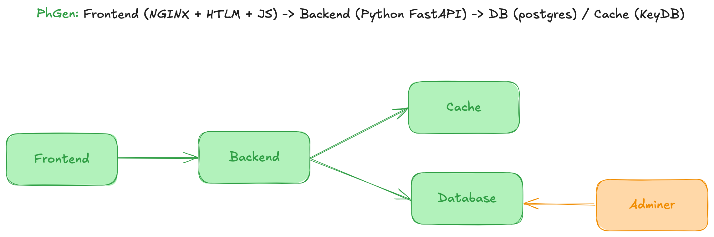

# PhGen App
A simple application but developed in a container approach. It's over engineered to improve/show skills about that idea. Technologies: Docker (for the dev environment), NGINX (Application webserver and proxy server between frontend and backend), Python (Rest API with FastAPI), HTML, JavaScript, Redis (KeyDB), and PostgreSQL.

## Architecture
All the application was developed to be in modules approach. We can run it with Docker (ideal for development) or Kubernetes.


## Technologies and logics
### Frontend
**NGINX**
- web server for application
- proxy server to allow frontend communicate with backend
**HTLM**
Used to construct the web UI
**JavaScript**
Defines how frontend interact with proxy server to get data from backend
---
The logic is:
- If frontend needs to know the current phrase, frontend sends a GET request to backend via proxy pass to get the current phrase (more details in Backend section).
- If frontend wants to change the current phrase, frontend sends a GET request to backend via proxy pass to change the current phrase, and also, after that, frontend sends another GET request to backend via proxy pass to get the current phrase (more details in Backend section).

### Backend
**Python FastAPI**
- API Rest that interacts with a Postgres database and KeyDB cache.
- At the first moment, it's only a read-only client for database. For cache, it can read and write.
---
The logic is:
- If frontend needs to know the current phrase, backend will get that from cache to give this data to frontend.
- If frontend wants to change the current phrase, backend will get a random phrase from database and set that into cache.

### Database
Uses PostgreSQL. In both Kubernetes and Docker, I created with persistent volumes. For Docker approach, the database will start with the table and some test values inserted. For Kubernetes, the database will start clean (necessary adminer to create the table and to insert the lines).

```sql
CREATE TABLE IF NOT EXISTS phrases (
    id     SERIAL,
    phrase TEXT PRIMARY KEY
);

INSERT INTO phrases (Phrase) VALUES ('Hello DB 1!');
INSERT INTO phrases (Phrase) VALUES ('Hello DB 2!');
INSERT INTO phrases (Phrase) VALUES ('Hello DB 3!');
INSERT INTO phrases (Phrase) VALUES ('Hello DB 4!');
INSERT INTO phrases (Phrase) VALUES ('Hello DB 5!');

SELECT * FROM phrases;
```


### Cache
KeyDB (Redis fork)


### Adminer
Database SQL admin tool, used to interact with the Postgres if it is necessary. To connect adminer with the postgres database, access the web UI (port 8080 of the adminer container). Login with the following values:

For the Docker approach:
```yaml
System: PostgreSQL
Server: ph-gen-app-database
Database: ph-gen-db
User: app
Password: 123
```

For the Kubernetes approach:
```yaml
System: PostgreSQL
Server: database.ph-gen-app.svc.cluster.local
Database: ph-gen-db
User: app
Password: 123
```


## Project structure
```
├── arch.png
├── kubernetes                  <--- Kubernetes manifests to run all the application in a Kubernetes cluster
├── README.md
└── src
    ├── backend
    │   ├── api
    │   │   ├── main.py         <--- REST API creation file - routes and API instantiation
    │   │   └── services
    │   │       ├── cache.py    <--- API to communicate with the cache (KeyDB)
    │   │       └── database.py <--- API to communicate with the database (PostgreSQL)
    │   ├── Dockerfile          <--- Docker image recipe to create the container image for backend
    │   └── requirements.txt    <--- Python lib requirements that will be installed by pip (in build time)
    ├── docker-compose.yaml     <--- File to create the containerized development environment
    ├── frontend
    │   ├── Dockerfile          <--- Docker image recipe to create the container image for frontend
    │   ├── html
    │   │   ├── index.html      <--- Frontend main page
    │   │   └── script.js       <--- Frontend logic to communicate with the backend (using the nginx as proxy server)
    │   └── nginx-files
    │       └── default.conf    <--- Create the webserver to serve the application and works as 
    │                                proxy server to  frontend communicate with backend
    └── initdb                  <--- Init SQL commands to setup the database (only for the Docker approach)
        └── 01_schema.sql
```
